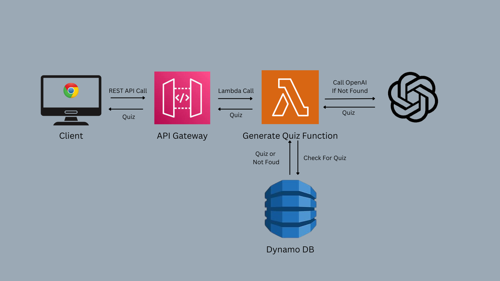

# Were You Really Reading? 
## An AI Reading Comprehension Quiz Generator

## Background
I created this project in an attempt to hone my HTML, CSS, JS, and back end development skills. Do you ever finish passively reading something and realzie you haven't actually absorbed any of the information? This handy Chrome Extension uses generative AI to create a short, multiple-choice quiz for any website to improve reading comprehension.

## Tech Stack

### Front End
1. Chrome Extension
- HTML and CSS for content and styling
- JavaScript for the following:
  - Extracting text from pages
  - Managing state (using chrome local storage)
  - Sending requests to backend API
  - Handling UI interactions
2. **Chrome Storage API**
- Stores the state of the application, allowing popup to be opened and closed without losing the current quiz and progress
 
### Back End

1. **AWS DynamoDB** (no-sql database)
- Used for effeciently storing past quizzes
- Reduces costs by minimizing OpenAI API calls

2. **AWS Lambda Function**
- **Node.JS** runtime environment
- **OpenAI API**
- Does the following:
  - Checks DynamoDB for existing quiz to prevent unescessary OpenAI API calls
  - Generates new quizzes using OpenAI's JSON response mode if existing quiz not found
  - Stores new quiz in DynamoDB 

3. **AWS API Gateway**
- Creates a REST API for lambda function

### Features
- Simple, intuitive, and interactive UI with dynamic content
- Text extraction and filtering: removes unescessary characters to reduce cost of OpenAI API call
- AI Quiz generation that works on any website that isn't abnormally long (can add support for long websites in the future by splitting websites into portions and making multiple API calls)
- Persistent application state that allows user to seamlessly close popup and revisit without losing progress
- Serverless, lower-cost quiz generation function
- Effecient quiz generation with DynamoDB to prevent repeat quizzes
- Blurs page until show answers or reset is clicked to discourage cheating ;)
- Indicates which answer is correct, which you selected, and a graphic displaying your score upon clicking "show answers"
### UI Screenshots

### App Demo

### Back End Diagram

