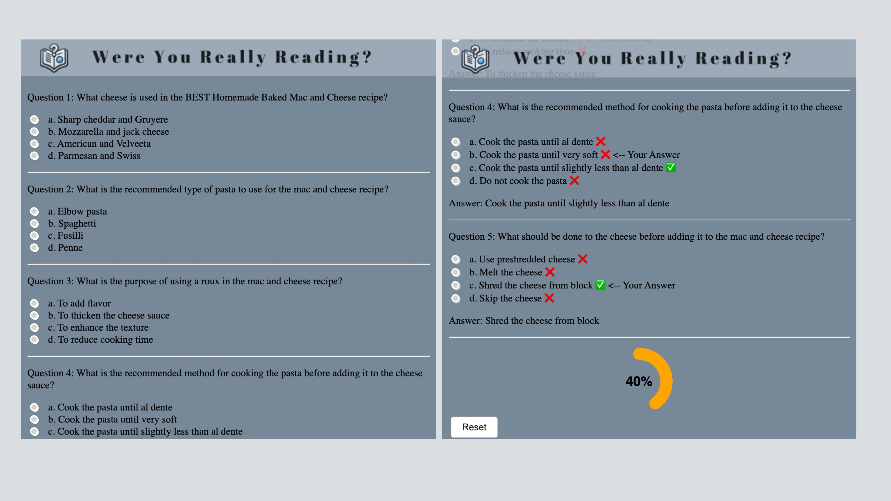
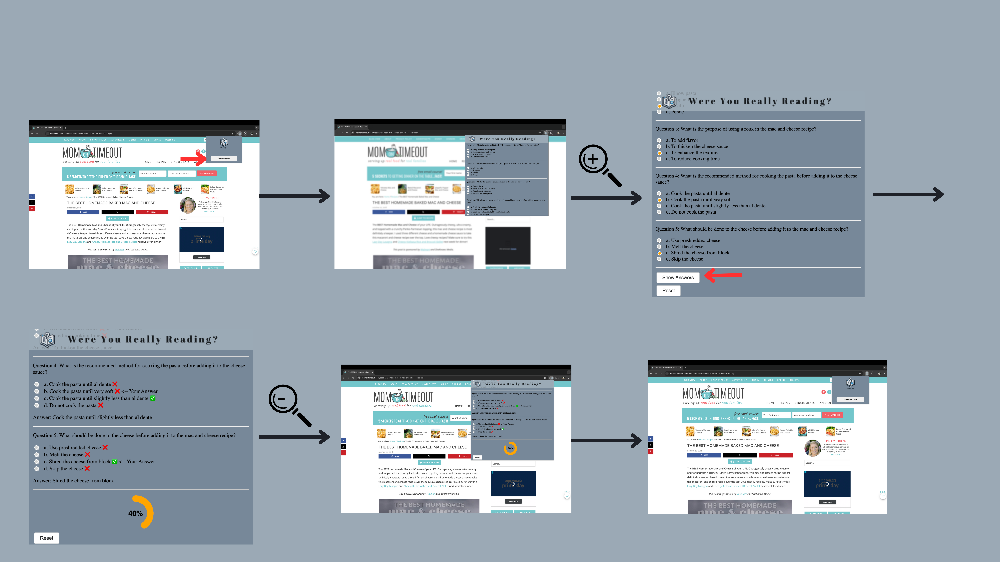
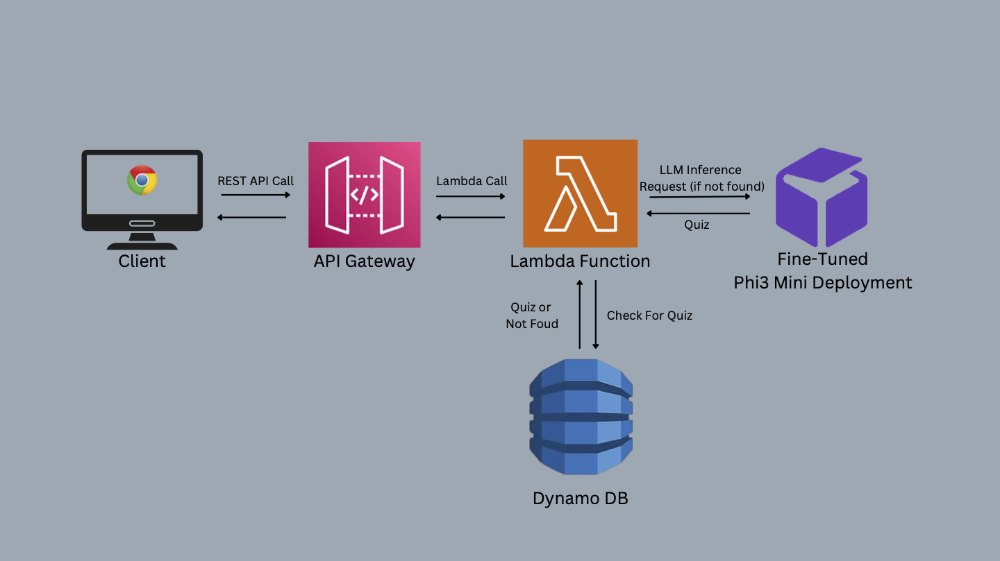

# Were You Really Reading? 
## An AI Reading Comprehension Quiz Generator

## Background
I created this project in an attempt to hone my dataset manipulation, LLM fine-tuning, and web development skills. 

Do you ever finish passively reading something and realize you haven't actually absorbed any of the information? This handy Chrome Extension uses generative AI to create a short, multiple-choice quiz for any website to improve reading comprehension.

## Tech Stack

### Front End
1. Chrome Extension
- HTML and CSS for content and styling
- JavaScript for the following:
  - Extracting text from pages
  - Managing state (using chrome local storage)
  - Sending requests to backend API
  - Handling UI interactions
2. **Chrome Storage API**
- Stores the state of the application, allowing popup to be opened and closed without losing the current quiz and progress
 
### Back End

1. **AWS DynamoDB** (no-sql database)
- Used for efficiently storing past quizzes
- Reduces costs by minimizing OpenAI API calls

2. **AWS Lambda Function**
- **Node.JS** runtime environment
- Does the following:
  - Checks DynamoDB for existing quiz to prevent unescessary inference
  - Calls custom fine-tuned Phi3 Model to generate new quizzes if existing quiz not found
  - Stores new quiz in DynamoDB
  - Responds to cline with quiz

3. **AWS API Gateway**
- Creates a REST API for lambda function

4. **Custom Fine-Tuned Phi3 Mini Deployment (Runpod Serverless)**
- Generates quizzes given websie content
- Called by the Lambda Function above 

### Features
- Custom Fine-Tuned Phi3 Mini Model for quiz generation
- Simple, intuitive, and interactive UI with dynamic content
- Built on a completely serverless, pay per second architecture
- Efficient quiz generation with DynamoDB to prevent repeat quizzes
### UI Screenshots

### App Demo

### Back End Diagram

